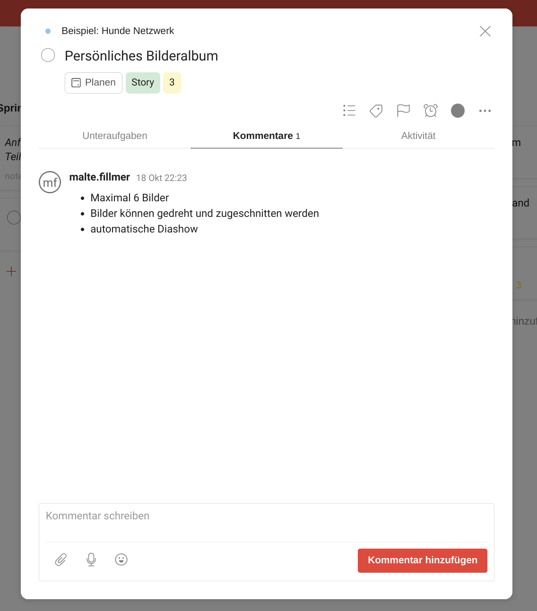

## Modernes Projektmanagement

Neben der eigentlichen Programmierung einer Software spielt auch das Projektmanagement eine wichtige Rolle.
Im Laufe der Jahre gab es viele Trends und Ideen, wie man ein Software-Projekt am besten auf die Beine stellt.
Ein sehr moderner Ansatz ist Scrum, die Grundlage für meine eigene Art des Projektmanagements. 

> Scrum ist eine agile Methode, bei der es darum geht, dem Kunden möglichst schnell das zu liefern, was er braucht, ohne alles vorab bis ins kleinste Detail zu planen. 

### Konkret finden folgende Schritte dabei statt:

1. Alle Anforderungen werden aufgenommen und in das sogenannte `Backlog` eingetragen.
2. Ein Teil der Anforderungen wird für das erste Teilprodukt, auch `Iteration` genannt, ausgewählt.
    - Ziel ist es, dass dieses Teilprodukt bereits produktiv einsetzbar ist.
    - Ausgewählte Anforderungen stehen im `Sprint Backlog`.
3. Es wird ein Zeitraum (z.B. 2 Wochen) festgelegt, in dem das Teilprodukt realisiert wird. Das ist der erste `Sprint`.
4. Während des Sprints wird eine Übersicht gepflegt, welche Aufgaben fertig sind, gerade bearbeitet werden oder noch ausstehen
5. Am Ende des Sprints wird das Teilprodukt präsentiert. Hier haben Sie die Möglichkeit, direkt neue Ideen einzubringen, Features zu testen und generell Feedback zu geben. 

Die Schritte 2. bis 5. werden dann solange wiederholt, bis das Projekt fertig ist und Sie ein Produkt in den Händen halten, was Ihnen wirklich nützt.

### Theorie ist gut, ein Beispiel ist besser

Scrum ist zwar nicht sehr umfangreich, aber es bringt einige Konzepte mit sich, die vielleicht nicht direkt verständlich sind. Daher hier ein Beispiel:

Angenommen, Sie möchten ein Soziales Netzwerk für Hundebesitzer gründen. Die Besitzer sollen sich austauschen können, neue hundefreundliche Orte finden und auch Verkäufer von Hundeprodukten sollen einen Platz auf der Plattform haben. 

In der ersten Iteration sollen dabei Grundfunktionalitäten und Nutzerprofile enthalten sein.

Während des Sprints können Sie außerdem immer den aktuellen Stand verfolgen. 

### Kontextebezogene Kommunikation

In dieser Übersicht ist es außerdem möglich, einzelne Anforderungen direkt zu kommentieren.
So werden Missverständnisse vermieden und die Kommunikation verläuft viel effizienter, da nicht erst erklärt werden muss, um welche Anforderung ee eigentlich gerade geht. 

